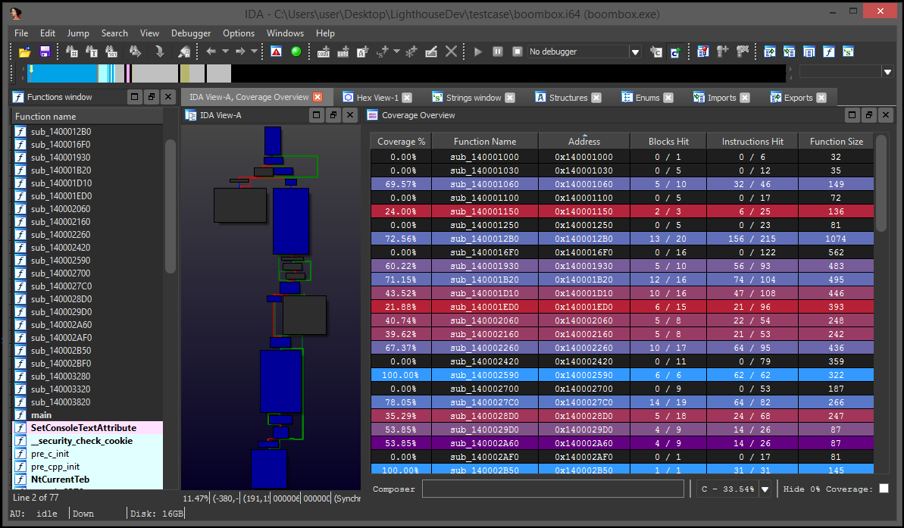

# Lighthouse - Code Coverage Explorer for IDA Pro


## Overview

Lighthouse is a Code Coverage Plugin for [IDA Pro](https://www.hex-rays.com/products/ida/). The plugin leverages IDA as a platform to map, explore, and visualize externally collected code coverage data when symbols or source may not be available for a given binary.

There are no bells or whistles. This plugin is labeled only as a prototype and code example for the community. 

Special thanks to [@0vercl0k](https://twitter.com/0vercl0k) for the inspiration.

## Releases

* v0.2 -- Multifile support, perfomance improvements, bugfixes.
* v0.1 -- Initial release

## Installation

Install Lighthouse into the IDA plugins folder.

- Copy the contents of the `plugin` folder to the IDA plugins folder
    - On Windows, the folder is at `C:\Program Files (x86)\IDA 6.8\plugins`
    - On MacOS, the folder is at `/Applications/IDA\ Pro\ 6.8/idaq.app/Contents/MacOS/plugins`
    - On Linux, the folder may be at `/opt/IDA/plugins/`

The plugin has only been tested on IDA Pro 6.8, 6.95 for Windows.

## Usage

Lighthouse loads automatically when an IDB is opened, installing the following menu entries into the IDA interface:

```
- File --> Load file --> Code Coverage File(s)...
- View --> Open subviews --> Coverage Overview
```

These are the entry points for a user to load and view coverage data. One can load multiple coverage files at once.

## Coverage Overview

The Coverage Overview is a dockable widget that provides a function level view of the active coverage data for the database.



This table can be sorted by column, and entries can be double clicked to jump to their corresponding disassembly.

## Coverage Painting

Lighthouse 'paints' the active coverage data across the three major IDA views as applicable. Specifically, the Disassembly, Graph, and Pseudocode views.


## Collecting Coverage

At this time, Lighthouse only consumes binary coverage data as produced by DynamoRIO's [drcov](http://dynamorio.org/docs/page_drcov.html) code coverage module. 

Collecting blackbox coverage data with `drcov` is relatively straightforward. The following example demonstrates how coverage was produced for the `boombox.exe` testcase provided in this repository.

```
..\DynamoRIO-Windows-7.0.0-RC1\bin64\drrun.exe -t drcov -- boombox.exe
```

This command will produce a `.log` file consisting of the coverage data upon termination of the target application.

## Other Coverage Sources

[drcov](http://dynamorio.org/docs/page_drcov.html) was selected as the initial coverage data source due to its availability, adoption, multi-platform (Win/Mac/Linux), and multi-architecture (x86/AMD64/ARM) support. 

Intel's [PIN](https://software.intel.com/en-us/articles/pin-a-dynamic-binary-instrumentation-tool) for example does not come with a default code coverage pintool. It appears that most implement their own solution and there is no clear format for Lighthouse to standardize on. In the future, Lighthouse may ship with its own pintool.

While Lighthouse is considered a prototype, internally it is largely agnostic of its data source. Future work will allow one to drop a loader into the `parsers` folder without any need for code changes to Lighthouse. Right now, this is not the case.

## Future Work

Time and motivation permitting, future work may include:

* ~~Multifile/coverage support~~
* Profiling based heatmaps/painting
* Automatic parser pickup
* Parsers for additional coverage sources, eg PIN
* Improved Pseudocode painting

## Authors

* Markus Gaasedelen ([@gaasedelen](https://twitter.com/gaasedelen))
